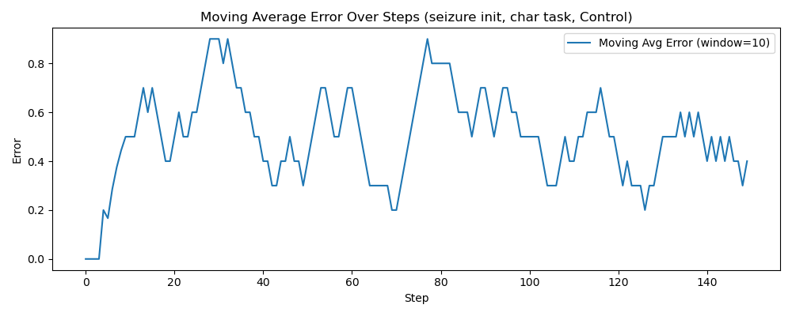
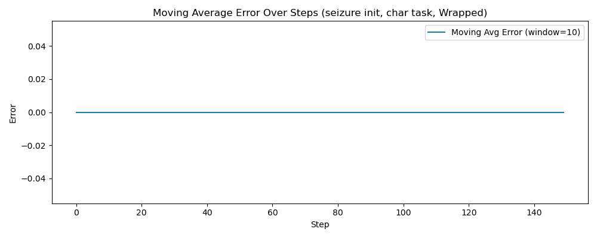
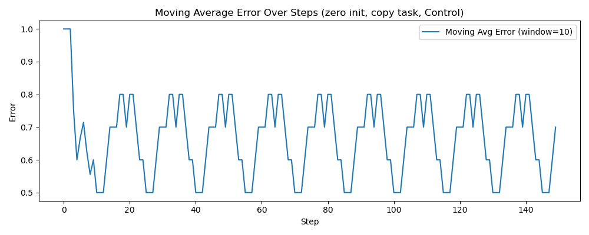

# EnergyWrapper

A Python library for wrapping neural networks in an energy system that:
* ensures neurons fire at some point (zero init hidden layers and RL action output layers can learn)
* stops pathalogical attractors from forming and undoes them
* Causes Curiosity RL on every set of neurons or layers it is applied to
* Causes hidden layers to act as input predictors when given no other learning functions

[](https://www.python.org/downloads/)
[](https://opensource.org/licenses/MIT)

# Results

Larger error is worse.

Post training results from a "seizure init" RNN with a pathalogical attractor built in. The pathalogical attractor could not be removed through normal training:
[]()
Post training results from the energy wrapped RNN:
[]()
copy task that's more repetitive. This time with a zero-init RNN. It was unable to learn:
[]()
Post training on a wrapped neural network:
[

```bash
# Clone the repository
git clone https://github.com/simleek/energywrapper.git
cd curious-rl

# Install in editable mode
pip install -e .
```

### Direct from GitHub

```bash
# Install latest from main branch
pip install git+https://github.com/simleek/energywrapper.git
```

## License

MIT License - see LICENSE file for details.

manual_qwen3_vl.py is under the apache 2.0 license

## Citation

If you use this library in your research, please cite:

```bibtex
@software{energywrapper,
  author = {SimLeek},
  title = {EnergyWrapper: A Python library for wrapping neural networks in an energy system},
  year = {2026},
  url = {https://github.com/simleek/energywrapper}
}
```
